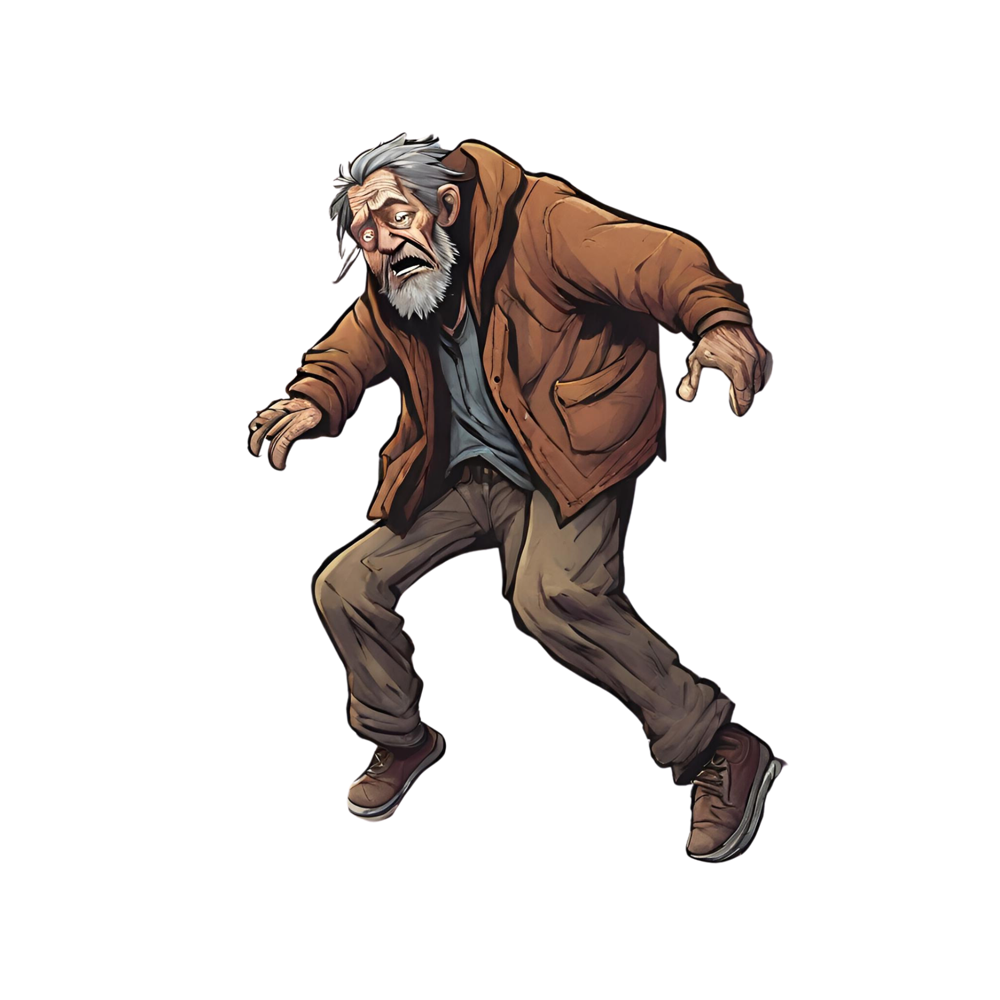

# Project Name

I've been asked about parallax a few times recently so I decided to refamilarize myself with it a bit. It's actually been a long time since I worked with html/js/css and not angular or react, npm, node, sass, etc so it was fun. I would like to make a much taller page to have more fun but this was just to knock the cobwebs off.

## Live Demo

View the live demo of the project [here](https://benatwerk.github.io/superfluous-parallax/).

## Technologies Used

-   **HTML5**: For the markup.
-   **CSS3**: For styling and animations.
-   **JavaScript**: For interactivity and animations.
-   **ScrollMagic**: Used for creating scroll animations.
-   **GSAP**: Used in conjunction with ScrollMagic for enhanced animations.

